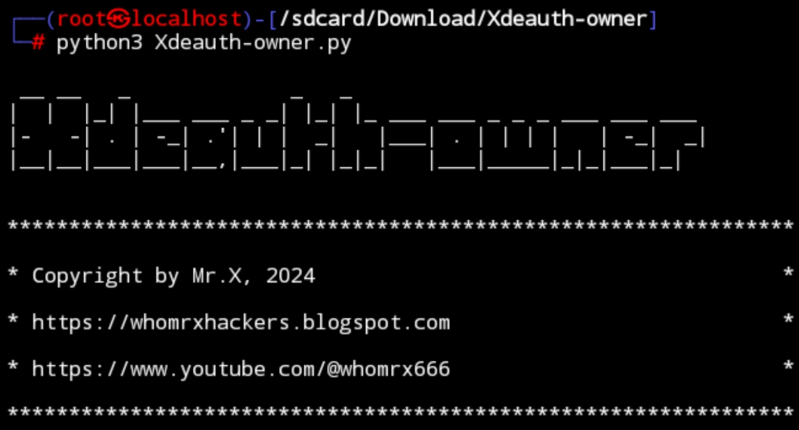

# Xdeauth-owner 


## introduction
Xdeauth-owner is a tool that can place us as the owner of the WiFi by being able to determine who can use the WiFi by typing in the MAC address of the cellphone that you want to make the owner or the only one a device that can use wifi by turning off other connections

## Instalations
```
$ apt update -y && apt upgrade -y
$ apt install git
$ apt install python3 -y
$ git clone https://github.com/Whomrx666/Xdeauth-owner
$ cd Xdeauth-owner
$ python3 Xdeauth-owner.py
```

### **Things needed for the tool to run**

This tool requires several things that you must have so that it can run normally and can be used as efficiently as possible:

- Kali linux / nethunter / ubuntu / debian/ and others
- Wireless adapter that supports monitor mode
- Sudo access
- And of course the internet

## Note!
The brand of wireless adapter that I use is Tp-link Tl-wn722N version 1.10 {support monitor mode}

## Instructions
- **first**: Install tools according to the instructions above
- **second**: Make sure you have connected your wireless adapter before running the tool
- **third**: Go to tools and enter the MAC address of the cellphone you want to make the owner and click enter
- **four**: Enter the wifi adapter network, usually the name is Wlan0
- **fifth**: Let the tool scan the WiFi around us
- **sixth**: Select the wifi network you want to turn off
- **last**: Type enter and the tool will automatically turn off the network of all devices connected to the WiFi apart from the network from the cellphone whose MAC address we entered at the beginning

## Observation
This is a tool for education only, I am not responsible for any misuse
### Original Author
<a href="https://github.com/Whomrx666"></a>

### <<< If you copy , Then Give me The Credits >>>

## CONNECT WITH ME :

[](https://whomrxhackers.blogspot.com/)
[](https://twitter.com/whomrx666)
[](https://wa.me/6285926601133?text=Halo%2C%20Mr.X)
[](https://www.facebook.com/whomrx.666)
[](https://t.me/Whomr_X)
[](mailto:whomrx666@gmail.com)
[](https://www.tiktok.com/@whomr.x)

**If you want to donate, click on the button**
<a href="https://saweria.co/whomrx"></a>

---

<p align="left">
  
</p>

---